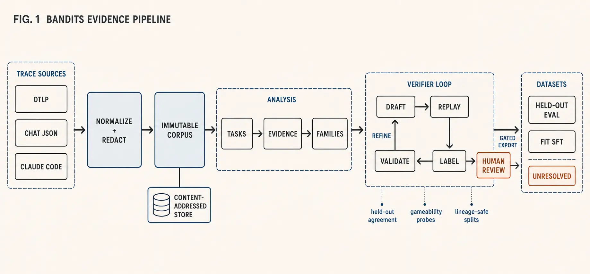

<div align="center">

# Bandits

### Build trustworthy datasets from agent traces.

[](https://github.com/vektori-ai/bandits/actions/workflows/quality.yml)
[](https://www.python.org/downloads/)
[](https://docs.astral.sh/uv/)

Bandits turns real agent runs into SFT data, eval cases, and tested success checks without hiding missing evidence.

[Why Bandits?](#why-bandits) · [Quickstart](#quickstart) · [Workflow](#workflow) · [Trust model](#trust-is-a-data-model) · [CLI](#cli-reference)

</div>

---

Agent traces already contain the work: the request, the decisions, the tool calls, and the result. Bandits turns that history into a chain of evidence, from raw runs to reviewed eval and training data.

<div align="center">
  
</div>

## Why Bandits?

- **Keep the truth.** Normalize OTLP, chat JSON, and Claude Code traces without inventing missing results or dropping malformed records.
- **Know why a run passed.** Keep observed state, external results, model judgments, human labels, and self-reports separate.
- **Test the judge.** Measure verifiers on held-out labels and try to game them before they can authorize a dataset.
- **Trace every row.** Follow an export back through its verifier, task family, analysis, and original corpus.

## Quickstart

Bandits requires Python 3.11 or newer. The repository uses [uv](https://docs.astral.sh/uv/) for reproducible environments.

```bash
git clone https://github.com/vektori-ai/bandits.git
cd bandits
uv sync
```

Ingest the included OTLP fixture and inspect the resulting corpus:

```bash
uv run bandits ingest tests/fixtures/traces.otlp.jsonl --source otlp

# The fixture deterministically produces corpus-67e49fdc2268c1e5.
uv run bandits show corpus-67e49fdc2268c1e5
uv run bandits show corpus-67e49fdc2268c1e5 --issues
```

Bandits writes immutable artifacts to `.bandits/` in the selected project directory. Re-ingesting identical normalized content resolves to the same ID.

### Supported inputs

| Source | Flag | Expected shape |
| --- | --- | --- |
| OpenTelemetry | `--source otlp` | OTLP JSON or JSONL span exports |
| Chat transcripts | `--source chat-json` | One JSON conversation or an array of conversations |
| Claude Code | `--source claude-code` | One session JSONL file or a directory of sessions |

The input format is always explicit. Bandits does not guess and risk accepting a plausible-looking misparse.

## Workflow

Use this when success needs to be explainable, measured, and tied to an owner decision.

```bash
# 1. Extract candidate tasks and outcome evidence.
uv run bandits analyze <corpus-id> --tasks

# 2. Group related work and create lineage-safe fit/held-out splits.
uv run bandits mine <analysis-id> --budget 20
uv run bandits families <task-set-id>

# 3. Draft checks for one family and run them over historical fit traces.
uv run bandits draft-verifier <task-set-id> --family <family-id>

# 4. Label disagreements first, where one decision is most informative.
uv run bandits label <verifier-draft-id> --labeler "your-name"

# 5. Measure agreement and actively probe the checks for gameability.
uv run bandits validate-verifier <verifier-draft-id> --labels <label-set-id>

# 6. Record explicit owner acceptance of one measured verifier.
uv run bandits review-verifier <verifier-draft-id> \
  --validation <validation-id> \
  --verifier <verifier-id> \
  --acceptance-id <ticket-or-review-id>

# 7. Export held-out evals or successful fit demonstrations.
uv run bandits export <task-set-id> --format eval \
  --verifier <reviewed-verifier-id> --output eval.jsonl

uv run bandits export <task-set-id> --format sft \
  --verifier <reviewed-verifier-id> --output sft.jsonl
```

Every export also writes a sibling `<name>.unresolved.jsonl`. Ineligible or unscorable traces are quarantined with reasons instead of vanishing from the dataset.

An SFT export additionally writes `<name>.composition.json`: a versioned report describing the partition offered and the rows selected, broken down by task family, source, generating model, tool, and lineage, with message and character distributions and the duplicate groups it collapsed. Every gate in the exporter judges one trace at a time, so none of them can see that most of what passed came from a single lineage or a single tool.

Sampling caps act on what that report shows. They are unset by default, and a row a cap removes is quarantined naming the cap that removed it:

```bash
uv run bandits export <task-set-id> --format sft \
  --verifier <reviewed-verifier-id> --output sft.jsonl \
  --max-rows-per-lineage 3 --max-rows-per-family 200
```

> [!NOTE]
> Message and character counts are tokenizer-independent approximations of what a row costs. No tokenizer is configured anywhere in this pipeline, and nothing in the report may be read as a token count.

> [!NOTE]
> SFT defaults to the `fit` partition; eval defaults to `held_out`. Passing `--split all` is allowed but recorded as an overlap warning in the export manifest.

### Duplicates and the held-out split

The fit/held-out split moves whole lineage groups, so a declared retry chain never straddles it. Lineage ids are read from the source and never inferred, so two runs of the same request from different sessions arrive as independent groups — and a source that declares no lineage at all leaves every trace its own.

Before splitting, lineage groups are unioned by duplicate evidence: identical requests, and — where a backend can measure it — requests above a much stricter similarity than the one used for grouping. Sameness is measured on requests with their identifiers intact, never on the masked descriptors grouping compares, because under those `refund order 7741` and `refund order 8802` are one string.

The joins are recorded on the family as auditable edges rather than applied silently, and survive a reviewer's correction: `merge-families` reads the analysis so it can find lineages the two families disagreed about, moves any that end up on both sides whole to one side, and says it did. Without them, a verifier drafted from a fit trace can be measured against a held-out trace carrying the same answer, and held-out agreement reports memorisation as generalisation — which is the number the promotion gate treats as its central evidence.

### What produced a grouping

A task set records the clustering that formed its families: the distance backend, the resolved similarity threshold and neighbor count, and — where vectors were compared — the embedding model and the cache artifact holding them. Resolved values, not the flags that were passed, so an omitted flag records the default that actually applied.

Mining the same analysis twice under different settings produces two task sets that differ in content, and therefore in id. This is what explains why. It is also what an embedding grouping needs in order to be reproducible at all: `EmbeddingCache` refuses to mix vectors from two models because they are not comparable, and a task set grouped by those vectors inherits the constraint.

### Tasks without deterministic outcome state

For conversational or otherwise unstructured work, a sampled model judge can add rubric evidence:

```bash
uv run bandits judge <task-set-id> \
  --family <family-id> \
  --criterion "The response resolves the user's request accurately"
```

Sample disagreement is treated as uncertainty worth labeling. Model judgment remains lower-trust evidence and does not bypass the verifier lifecycle.

## Trust is a data model

Bandits keeps source evidence immutable and stores every interpretation beside it as a new derived artifact:

```text
.bandits/
├── artifacts/
│   └── corpus-…/
│       ├── corpus.json
│       └── envelope.json
└── derived/
    ├── analysis-…/
    ├── taskset-…/
    ├── verifier-draft-…/
    ├── validation-…/
    ├── reviewed-verifier-…/
    └── export-…/
```

That separation matters: changing an analysis policy or correcting a verifier creates a new artifact; it never rewrites what the source trace recorded.

Verifier status also carries a concrete meaning:

| Status | What it establishes |
| --- | --- |
| `suggested` | A plausible check specification exists |
| `executable` | The check can run against recorded evidence |
| `calibrated` | It has been measured against historical labels |
| `reviewed` | It cleared promotion checks and has explicit human acceptance |
| `risk_accepted` | An owner promoted it despite recorded blockers |
| `rejected` | Evidence contradicted the verifier or exposed unacceptable gaming |

A verifier cannot be promoted as `reviewed` unless held-out evidence is labeled and scorable, labels cover both success and failure, and constructed attacks do not pass. `--accept-risks` preserves an override as the distinct `risk_accepted` status and carries the blocker codes into downstream manifests.

## Dataset contracts

Verifier-gated eval rows contain the instruction, complete grader specification, and full artifact lineage. SFT rows use chat-completions-shaped `messages`, including correctly paired assistant `tool_calls` and `tool` results.

Demonstration selection additionally rejects or quarantines trajectories with properties such as:

- missing actions, results, or generating-model metadata;
- recorded tool errors or recovery paths;
- repeated identical tool actions;
- unusually long trajectories relative to their task family;
- verifier inputs that are unavailable;
- near-duplicates of already selected examples;
- rows beyond a configured family, lineage, or per-row size cap.

These are demonstration-quality gates, not claims that a successful outcome alone makes behavior worth imitating.

## CLI reference

| Command | Purpose |
| --- | --- |
| `ingest` | Normalize, redact, and store a trace export |
| `list` / `show` | Browse corpora, traces, spans, and ingest issues |
| `analyze` | Extract task candidates and outcome evidence |
| `mine` / `families` | Group tasks, split lineages without separating duplicates, and select representative runs, recording the clustering that produced them |
| `merge-families` / `split-family` | Record human corrections to proposed groupings |
| `draft-verifier` | Propose deterministic checks and replay them on history |
| `interview-verifier` | Refine a draft through a bounded owner interview |
| `label` | Label disagreements and the remaining family runs |
| `validate-verifier` | Measure fit/held-out agreement and probe gameability |
| `review-verifier` | Record explicit acceptance of a calibrated verifier |
| `judge` | Sample a rubric judge for unstructured outcomes |
| `export` | Write verifier-gated eval or SFT JSONL plus quarantine and composition report |

Run `uv run bandits <command> --help` for every option.

## Redaction and local state

Ingest uses the `default-v1` redaction ruleset by default. Use `--redaction secrets-only-v1` when email addresses are task identifiers that must be retained:

```bash
uv run bandits ingest traces.jsonl \
  --source chat-json \
  --redaction secrets-only-v1 \
  --project ./my-experiment
```

The source digest and selected redaction ruleset are part of corpus identity, so changing redaction produces a different content-addressed artifact. Local `.bandits/` state and `.env` credentials are ignored by Git; choose or ignore export paths according to your own data-retention policy.

## Development

```bash
uv sync --extra dev
uv run ruff check .
uv run pytest --cov=bandits --cov-report=term-missing
```

The test suite exercises ingestion fidelity, redaction, content-addressed storage, task mining, verifier execution and validation, model-judge behavior, and both verifier-gated export formats.

## Project map

```text
bandits/
├── ingest/      # OTLP, chat JSON, and Claude Code adapters
├── analyze/     # task extraction, evidence, embeddings, and families
├── verify/      # draft, execute, interview, validate, review, and judge
├── export/      # verifier-gated SFT and portable eval JSONL
├── traces.py    # immutable canonical trace contracts
├── store.py     # content-addressed corpus and derived-artifact storage
├── redact.py    # deterministic redaction policies
└── cli.py       # Typer command-line interface
```

Bandits is intentionally domain-agnostic: coding agents, support workflows, browser automation, research, API agents, and other tool-using systems all enter through the same evidence model. Domain-specific definitions of success belong in reviewable verifier checks, not hidden inside the trace format.
